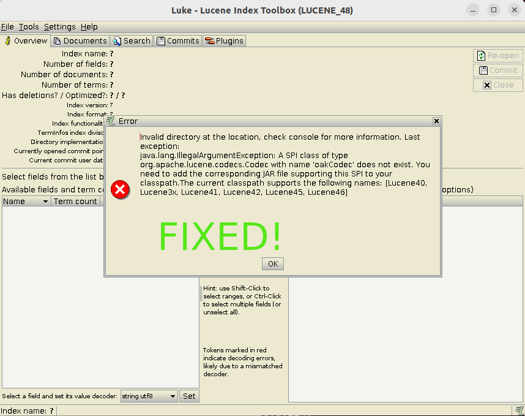

# Luke


This is a fork of the old Luke version [4.8.0.1](https://github.com/DmitryKey/luke/tree/4.8.0.1).
This project allows reading indexes created by Apache Jackrabbit Oak indexes.

The project Apache Jackrabbit Oak uses the old version of Apache Lucene [4.7.2](https://github.com/apache/jackrabbit-oak/blob/trunk/oak-parent/pom.xml).

`OakCodec simply mimics Lucene46Codec but with uncompressed StoredFieldsFormat` ([source](https://github.com/apache/jackrabbit-oak/blob/trunk/oak-lucene/src/main/java/org/apache/jackrabbit/oak/plugins/index/lucene/OakCodec.java))

This project solve the annoying problem of reading the indexes of Apache Jackrabbit Oak with the standard Luke version:
```
Invalid directory at the location, check console for more information. Last exception:
java.lang.IllegalArgumentException: A SPI class of type org.apache.lucene.codecs.Codec with name 'oakCodec' does not exist. You need to add the corresponding JAR file supporting this SPI to your classpath.The current classpath supports the following names: [Lucene40, Lucene3x, Lucene41, Lucene42, Lucene45, Lucene46]
```



## How to build
Use Java 8 to build the project.
```sh
mvn clean package
```

## Run the application
```sh
java -jar target/luke-oak-4.8.0.jar
```
